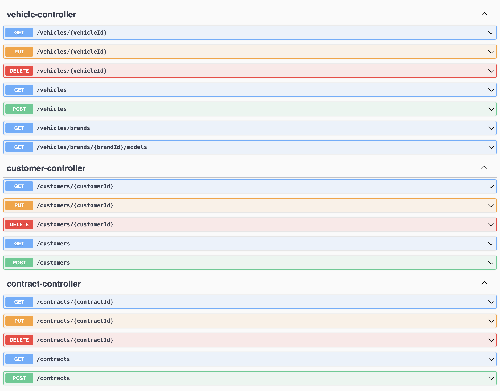
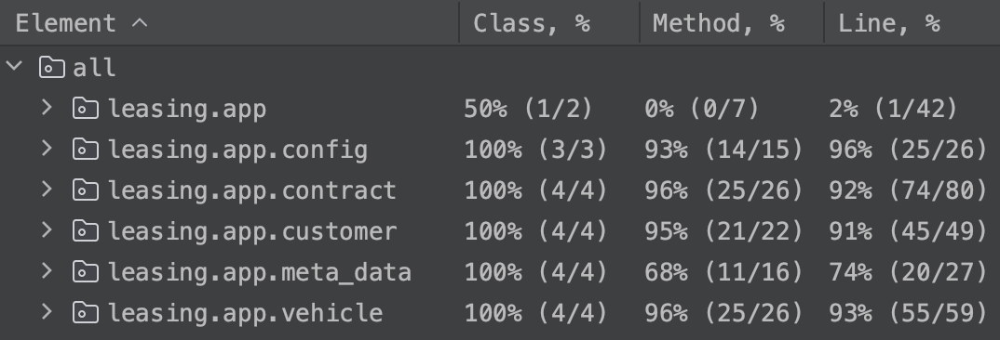

# Leasing App


## About

Leasing App is a RESTful Spring application designed to streamline contract, vehicle, and customer management. It leverages modern technologies like Docker and PostgreSQL to provide a robust and efficient solution for businesses and organizations looking to manage their operations effectively.



## Getting Started

### Prerequisites
* Install Docker. You can download it from [here](https://docs.docker.com/get-docker/) or install via brew `brew install --cask docker`
* Install Java 17. You can download it from [here](https://www.oracle.com/java/technologies/javase/jdk17-archive-downloads.html) or install via brew `brew install openjdk@17`

### How to Run
* Firstly, you should be sure Docker is running on your local machine.
* You should give permission to the script.
```
chmod +x ./scripts/run-app.sh
```
* If you want to run the project with sample data, you should run this script. `-p` args passing Spring profile to Docker container. The `load-data` profile recreates sample data on the database.
```
./scripts/run-app.sh -p load-data
```
* If you want to run the project without sample data, you should run this script.
```
./scripts/run-app.sh
```
* This project using Swagger and you can access it from this URL after running the application.
> http://localhost:8080/swagger-ui/index.html

* If you want to run only tests, you should run this script.
```
chmod +x ./scripts/run-tests.sh && ./scripts/run-tests.sh
```
### Run with IDE
* If you want to run the project with IDE then you should run the docker container manually. For running only the database container, you should run this command.
```
cd ./docker && docker-compose up -d postgres
```
* If you want to run the project with sample data, you need to run with a `load-data` active spring profile.

## Codebase Overview

### Folder Structure

```
.
├── docker      # Docker-related files are in this folder.
├── scripts     # Bash scripts are in this folder for running and testing the project.
├── src         # Feature-based folder structure applied to this folder.
│   ├── ...
│   │   │── app
│   │   │   ├── config     # Spring configurations are in this folder.
│   │   │   ├── contract   # All contract-related classes are in this folder.
│   │   │   ├── customer   # All customer-related classes are in this folder.
│   │   │   ├── exception  # Generic exception classes are in this folder.
│   │   │   ├── meta_data  # All meta data-related classes are in this folder.
│   │   │   └── vehicle    # All vehicle-related classes are in this folder.
│   │   │       ├── Vehicle.java
│   │   │       ├── VehicleController.java
│   │   │       ├── VehicleMapper.java
│   │   │       ├── VehicleRepository.java
│   │   │       ├── VehicleService.java
│   │   │       ├── VehicleServiceImpl.java
│   │   │       ├── dto        # Request and repoonse DTO files are in this folder.
│   │   │       └── exception  # Feature-based exceptions are in this folder.
│   └── test
│       │── app           # Test folders are corresponding src folder structure.
│       │   ├── contract
│       │   ├── customer
│       │   └── vehicle
```

### Details
* This project would benefit from utilizing a feature-based folder structure because business requirements consistently originate from the product. With this strategy, developers can easily locate the appropriate classes.
* The project's database comprises five distinct tables. The `brand` and `model` tables serve the purpose of creating vehicle wireframes, as they contain metadata required by the frontend, and this information can be managed within the database. On the other hand, the `vehicle` and `customer` tables store pertinent data, while the `contract` table incorporates foreign keys from both the `vehicle` and `customer` tables for reference.
* This project uses two different databases in one container because the main database should not be affected by the test data.
* This project utilizes **Flyway** for database migrations because it is essential to maintain a proper history and management of database operations.
* This project can be executed directly within a **Docker** container. Simply run `run-app.sh` located in the scripts folder.
* This project employs **Swagger** for testing endpoints. To access the **Swagger** page, please navigate to the following URL: http://localhost:8080/swagger-ui/index.html
* This project utilizes the **Datafaker** library to generate appropriate testing data. To enable the DataLoader class, activate the `load-data` Spring profile.
* This project leverages the **Mapstruct** library for generating mapper classes. Creating mapper classes manually results in excessive code repetition and can be challenging to maintain. However, **Mapstruct** automatically generates these classes for the project.
* This project utilizes **Lombok** to create clean and efficient data classes, and it also employs **Lombok**'s logger functionality for efficient logging.
* This project incorporates a BaseTest class to maintain a clean testing architecture. This class includes a set of reusable methods that streamline the process of writing tests by eliminating redundant code. Additionally, the project employs the DataCreator class to generate test data, with this data being sourced from the **Datafaker** library.
* The testing strategy for this project is centered around the controller layer. Each controller has its corresponding test classes, and these classes comprehensively cover all scenarios within the service layer.
* This project features a global error handler designed to manage and handle all errors that may arise on the backend.
* This project uses **GitHub Actions** for continuous integration, project building, and testing within GitHub.

## Technologies Used
| Category                 | Technology          |
|--------------------------|---------------------|
| Programming Language     | Java                |
| Framework                | Spring              |
| Build Tool               | Gradle              |
| Containerization         | Docker              |
| Database                 | PostgreSQL          |
| Database Migration       | Flyway              |
| Continuous Integration   | Github Actions      |
| API Documentation        | Swagger             |
| Data Generation          | Datafaker           |
| Object Mapping           | Mapstruct           |
| Code Simplification      | Lombok              |

## Test Coverage


## Author
<p style="text-align: center;">Emre Bozkurt</p>
<p style="text-align: center;"><a href="https://www.linkedin.com/in/emrebozkurt26">LinkedIn</a></p>
<p style="text-align: center;"><a href="https://emrebozkurt.de">Personal Webpage</a></p>

## License
This project is licensed under the terms of the [MIT license](/LICENSE).